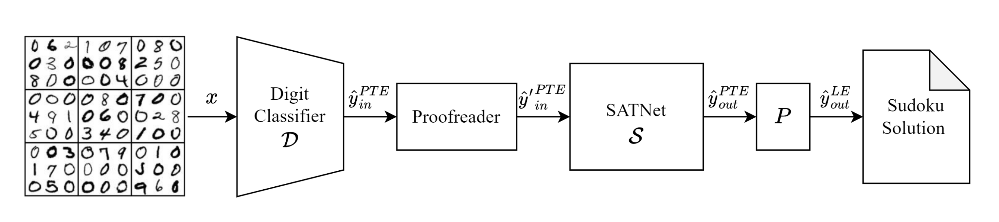

# Techniques for Symbol Grounding with SATNet

> Sever Topan, David Rolnick & Xujie Si

This repository is the official implementation of [Techniques for Symbol Grounding with SATNet](https://arxiv.org/abs/2106.11072).  This is a fork of the original SATNet implementation, the README of which can be found [here](satnet-README.md).




## Installation

Note: we run all subsequent commands from the satnet base repo folder unless otherwise specified.

Initialize submodules (used for InfoGAN training).
```
git submodule init
git submodule update
```

Next, download datasets (in root directory).
```bash
wget -cq powei.tw/sudoku.zip && unzip -qq sudoku.zip
wget -cq powei.tw/parity.zip && unzip -qq parity.zip
```

Load up the appropriate docker.
```bash
cd docker
sh ./build.sh
sh ./run.sh
```

Install local pip dependencies.
```
pip install -e .
```


## Running Experiments

Note that all models will be saved under the `logs` folder. All experiments are to be run from the `exps/sudoku` folder.

### 1 Running Experiments from the Base Paper

#### 1.1 Non-Visual

```
python exps/sudoku/run.py --mode nonvisual
```

This operating mode should be unaffected by the `--leak-labels` flag.

#### 1.2 Visual
```
python exps/sudoku/run.py --mode visual --leak-labels
```

Removing the `--leak-labels` flag will inhibit the model from learning.

### 2 Error Injection

Here we check the performance of a nonvisual sudoku model trained as in 1.1, when we inject a certain number of errors into the test set.

```
python exps/sudoku/run.py --mode nonvisual --load-model <path to trained nonvisual model> --num-errors 1
```

We experiment whether the system behaves differently if the injected errors result in solvable vs. unsolvable boards.
```
python exps/sudoku/run.py --mode nonvisual --load-model <path to trained nonvisual model> --num-errors 1 --solvability-split <solvable/unsolvable/any>
```

### 3 Proofread Models

Here we add in the proofreader layer as described in the paper. This step incrementally improves the model, by 0.1% (in the nonvisual case) and roughly 1.5% (in the visual case).

```
python exps/sudoku/run.py --mode train-proofreader-nonvisual --load-model <path to trained nonvisual model>
```

The proofreader can also be inserted into a visual model as well with the following command.

```
python exps/sudoku/run.py train-proofreader-lenet --load-model <path to trained proofread nonvisual model>
```

As with previous instances, `--leak-labels` will enable label leakage. In this instance, unlike the end-to-end visual learning, leaking the labels should still result in an improvement.

### 4 InfoGAN Frontend


#### 4.1 Train InfoGAN

```
cd exps/sudoku/infogan
python train.py
```

The training will run for 100 epochs, and the model will be saved after every 5. Use one of these saved files for the next steps. As mentioned in the ablation test within the paper, InfoGAN will sometimes converge to a non-optimal clustering of MNIST digits, which limits the rest of the pipeline's ability to learn. Test accuracy during training should be above the 88% threshold described in the paper. If it isn't, re-run training with a different seed.

#### 4.2 Extract Permutation Matrix Through SATNet

We now train using our Permutation Invariant Loss in order to extract the permutation matrix out of InfoGAN without looking at input cell labels at any point. Make sure to see section 4.6 as an alternative to this step, and the following ones.

```
python exps/sudoku/run.py --mode train-satnet-visual-infogan --load-model <path-to-infogan>
```

#### 4.3 Prepare Distillation Dataset

Next, we prepare a dataset from which to train the LeNet formulation of our architecture. Its important to do this in order to pull the learned permutation out of the previous model. During this step it may be a bit tricky to figure out which model from the previous step should be used. Pick the one from the corresponding minimal visual error.

```
python exps/sudoku/run.py --mode satnet-visual-infogan-generate-dataset --load-model <infogan-model>
```

This will create dataset files in the pwd. Reference this directory in the next step

#### 4.4 Distill InfoGAN into LeNet

```
python exps/sudoku/run.py --mode train-backbone-lenet-supervised --infogan-labels-dir <dir with files from 4.3> --load-model <model from 4.2>
```

#### 4.5 Train Model

```
python exps/sudoku/run.py --mode visual  --load-model <model from step 4.4>
```

Optionally the resulting model can then be trained with a proofreader

#### 4.6 Run-Pipeline (alternative to 4.2-4.5)

An automation script has been set up to make sections 4.2-4.5 easier to manage. Instead, run:

```
python run_pipeline.py --load-model <path to infogan>
```

It will automate the above steps.
